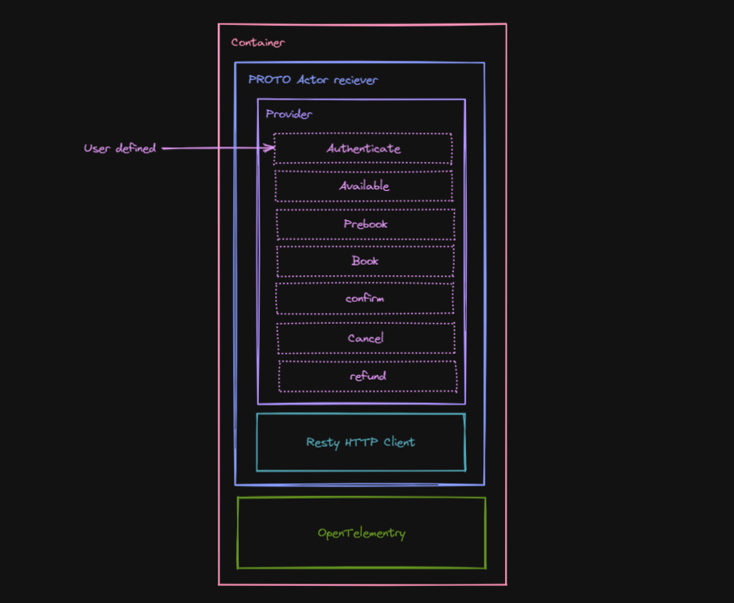

# goprovide

Easily implementing data providers for golang using IoC and DI.



## Developer's journy to building a data provider

A developer can build a data provider in a declarative like:

```golang
package main

import "github.com/mhdi-kr/goprovide"

func authenticate(context *goprovide.Context) *goprovide.response.authenticate {
    // Authentication imeplementation for a specefic provider
}
func available(context *goprovide.Context) *goprovide.response.available {
    // available imeplementation for a specefic provider
}
func prebook(context *goprovide.Context) *goprovide.response.prebook {
    // prebook imeplementation for a specefic provider
}
func book(context *goprovide.Context) *goprovide.response.prebook {
    // book imeplementation for a specefic provider
}
func confirm(context *goprovide.Context) *goprovide.response.confirm {
    // confirm imeplementation for a specefic provider
}
func cancel(context *goprovide.Context) *goprovide.response.cancel {
    // cancel imeplementation for a specefic provider
}
func refund(context *goprovide.Context) *goprovide.response.refund {
    // refund imeplementation for a specefic provider
}

actions := &goprovide.Actions{
    authenticate: authenticate,
    available: available,
    prebook: prebook,
    book: book,
    confirm: confirm,
    cancel: cancel,
    refund: refund,
}

config := &goprovide.Config{
    dsn: "sentry_dsn",
    ...
}

goprovide.Factory(actions, config)
```

## How it works

Under the hood there's an proto actor client listenting to core system. Any calls from that part of the container triggers a user defined implementation in the provider object.

The return of these functions are well communicated with core team and it is defined and will be checked in the compile time to reduce the errors.

The config object we are providing the `goprovide.Factory` method with is used for loggin, tracing and error handling and extra features we have in the library.